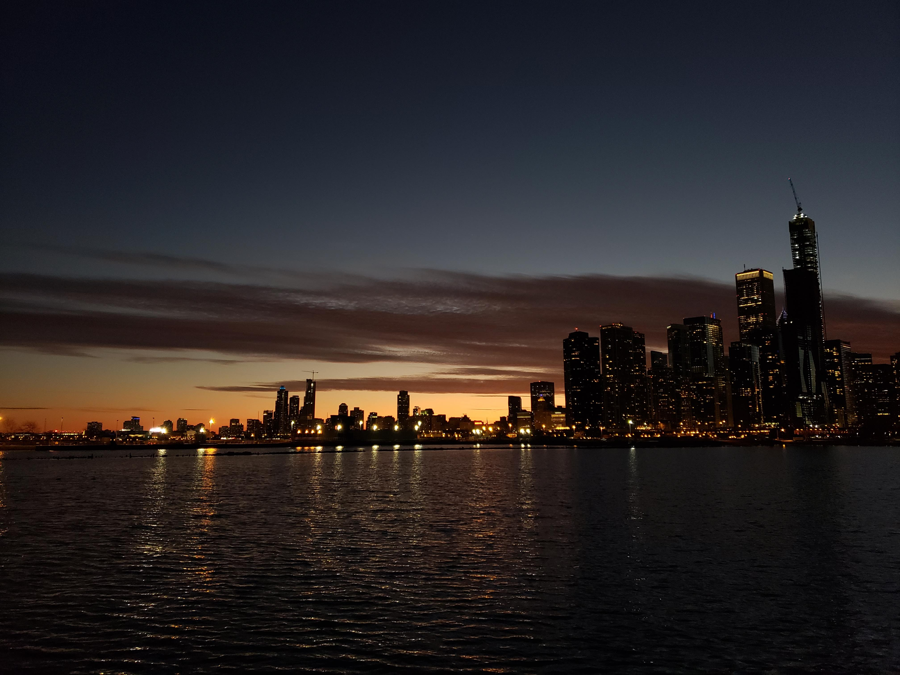

One block away from our apartment on W Polk Street in Chicago was *Jarabe*, arguably the - indulge me for a moment - greatest Mexican street food place in the world. When they first opened shop back in 2016, my taste in Mexican food was limited to the few places in and around University City in West Philadelphia. *Ugly Delicious* hadn't begun streaming on Netflix, so South Philly Barbacoa was still unknown to me.

When one hears about Chicago, a city known for its unhealthy obsession for cheesy casseroles masquerading as pizzas, good Mexican food is not what comes to mind. But it was in this unlikely city that I discovered the magic the cuisine had to offer. Jarabe was everything you needed your go-to place to be: it was inexpensive, it was convenient, and the food was frakking amazing. As a result, when I moved into the city in the summer of 2018, *Jarabe* became this quiet source of comfort when our Ph.D. lives came in the way of our cooking. You knew you could rely on *Jarabe* if you didn't have food in the house: that their chicken tinga would be there to throw you a line when you were drowning in the rejections that inundated your inbox; that their birria would be as tender as academia could be dry.

I miss *Jarabe* today, not just for its food, but also because it is associated with so many good memories from an especially rosy period of my life. Graduate school has a million downsides; but for me, it coincided with my getting married to Nilanjana, and subsequently setting up our first home together in Chicago. Of course, luck played its part, giving me a supportive academic community that allowed me the flexibility of pursuing my Ph.D. from hundreds of miles away. And our combined Ph.D. stipends meant that we could rent a comfortable but bare-bones garden unit apartment in the Near West Side and have some savings left over each month. It didn't matter that no sunlight entered our bedroom. It didn't matter that we didn't have a dishwasher. Hell, it didn't matter that doing the laundry meant first having to navigate Middle Earth in our backyard. We loved our time there.

There are many, many things that I miss about Chicago - and listing them all would be an exercise too futile. But it was in the evening walks to Nilanjana's lab, the spur-of-the-moment decisions to change dinner plans while walking past Port of Peri Peri, and the L rides to and from the Loop, that we fell in love with the city. When it was walkable (that is, when temperatures weren't -30oC or thereabouts), Chicago could regale you with its beautiful riverwalk, the quintessential Navy Pier, and the majestic but understated skyline, which was particularly charming in the light of the setting sun. A short walk away was the Art Institute, where we spent countless hours taking in Seurat's pointillism, Monet's water lilies, the Cholan Seated Buddha, and walked in Swami Vivekananda's footsteps in Fullerton Hall. 

Further north, near Lincoln Park, was Sushi Tokoro - the site of our All-You-Can-Eat sushi pilgrimage. This bi-monthly trip inevitably saw us pop into the Dollar Store next door and give utterance to our financially restricted grad student souls while waiting for the next bus 49 that would take us back home. En route was Pete's Fresh Market - our de facto grocery store, which, if you will forgive me for the hyperbole, was beyond outstanding. Unlike most regular grocery stores in the US, Pete's had dedicated aisles for every kind of cuisine imaginable - from Asian to Caribbean, from African to Mediterranean - above and beyond the regular American and Mexican and Italian. We virtually never needed to go to an Indian store because we found all essential Indian ingredients we ever needed, at Pete's - from fresh paneer, ghee, and idli batter, to delicious Punjabi samosas, bhakharwadi, and murukku. At the seafood counter, there was this friendly lady, who would greet us with her usual "let me know if you need anything, hon", and then, when we had small reasons to celebrate (paper acceptances, successful interviews, or even "yay, p < 0.005") we would deliberate overindulging in a slightly more expensive liquor and a fancy-ish block of cheese.

The cooking would begin when these ingredients would come home. The culinary chapter of our grad student lives probably deserves its own anthology (who knows, maybe it will happen someday), but we pretty much tried it all - to the point that unless a recipe was incredibly time-consuming or required ingredients that weren't easily available or substitutable, we likely took a stab at it. 

When we weren't cooking, exploring the city, or grinding away in front of our computer screens, we were laughing through whole seasons of Frasier, Veep, Mrs. Maisel, Silicon Valley, and a myriad other TV shows. Because my "research" didn't require dedicating a fixed set of hours per day - work and play would invariably blend into this curious state of being. This often meant that I would pause the TV (halfway through a Selina Meyer witticism) to check if my scraping script had thrown any new errors, or that Slack notifications would frequently interrupt a movie night - much to the chagrin of Nilanjana. The weekends would see us brewing ad-hoc cocktails before realizing that there's no ice in the refrigerator. As a bad idea though, it wasn't nearly as bad as waking up at 6 AM on a perfectly lazy Sunday to watch Arsenal lose 1-0 to West Ham. On Mondays, we would pay a visit to the neighborhood public library to pick stuff that we had put on hold. On the way back, we would stop either at Scafuri Bakery, or at Coffee Alley for a quick matcha date. Many a Tuesday would see us attempting to dispel imminent midweek blues by grabbing $5 movie tickets to the VIP circle at Showplace Icon. These evenings would reach their theatrical denouement, not in the theater, but outside, in an argument about the movie we had just watched. *The Rise of Skywalker was bad, but to what extent was it bad, and if it was really bad, then was it worth it - for the recliners in the theater, if not for anything else?* These were questions that would keep us company on our ride back home on Bus 157.

Gradually, as the dissertations began to take their respective shapes, and the job hunts began to take over our lives, the romance of the city took a backseat. Chicago receded into the distance, no longer the showstopper - no longer the Freddie Mercury piercing our souls with his high E, but rather, the John Deacon, who kept things ticking along with the hum of his bass. And not unlike Deacon's occasional sprinkling of magic that can make you sit up straight, the city could amuse you with quirky surprises as well; be it the Christkindlmarket at Daley Plaza with its hot spiced wine in the dead of winter, or the pistachio pesto pizza at Coalfire, which we both agreed, was the greatest pizza there could be; the Italian festival on Taylor Street and its scrumptious cannolis, or the air-and-water show over Lake Michigan on a breezy summer's day. And how could I ever forget watching Dream Theater live (albeit for a third time) in Chicago Theater? The city was great because it had so much to offer if you wanted something, but it would also leave you alone - occasional gunshot aside - if you weren't in the mood and wanted a quiet evening indoors.

By February 2020, when we were beginning to see the light at the end of the grad school tunnel, we had started putting together lofty albeit cautious plans of bidding adieu to this marvelous city, come the summer. There were two lists that we had compiled: one, of the things that we still hadn't done and we absolutely *had* to do, and another of the things that we wanted to redo at least one more time. Items on the former list included the Chicago Botanic Garden and the Gangsters and Ghosts Tour. Items on the latter included having that pizza again, taking in the skyline from Navy Pier and hitting the epic Division Street farmer's market for one last time. Chicago had given us so much, perhaps even the *belle epoque* of our lives, and anything short of a grand farewell would be a shame indeed.

*Here I pause to remind the reader of the literary device known as foreshadowing.*

*C'est la vie.* When we eventually left Chicago in July, we hadn't stepped out of our home in nearly 4 months - barring the unavoidable trips to the post-office or the pharmacy. Our regular graduation ceremonies were canceled. Both sets of parents, who had made elaborate plans to travel to the US in the summer to see us getting our doctorates, had to be content with watching our dissertation defenses on measly computer screens. Downtown Chicago remained desolate. The iconic Ferris Wheel at Navy Pier remained unlit. The pistachio pesto pizzas at Coalfire that we had promised to return to, remained uneaten. Both lists that we had so fondly curated remained unchecked. 

In the end, it felt like bidding an emotionally insufficient farewell to someone you have adored. You watch them walk away into the station, and a part of you expects them to turn around every few steps and wave. You want to see their face for one last time before they disappear from your view. Except that in this case, they never did. They just walked away.